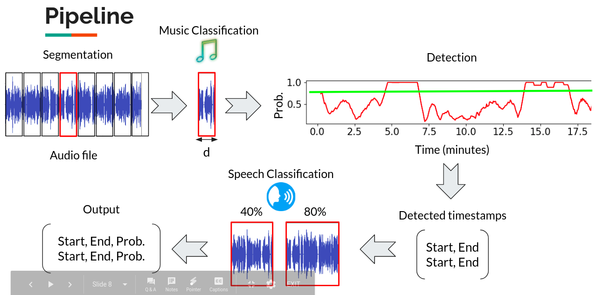
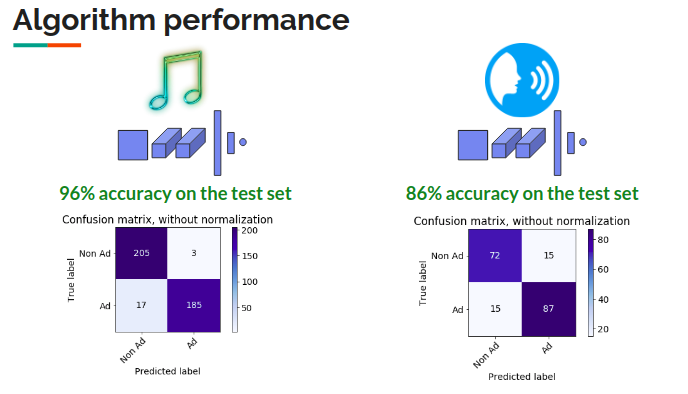

# Adetector - Finding Ads in Radio Streams
This is a consulting project for Veritonic Inc. done as part of Insight Artificial Inetligence Fellowship.

## Background
The digital audio advertising market has grown by more than 68% in the last two years reaching $2.3 billion, but there is still no objective way to quantify the quality of an audio ad. Veritonic is the first analytic platform that does just that by crowdsourcing customer reviews of ads and analyzing them. As this is both expensive and inefficient, automating the process using ML models that score ads is desirable, but that demands a lot of data!

Adetector uses two cascaded CNN models to detects audio ads in radio streaming in order to automate Veritonic's audio ad data collection. The algorithm separates speech from music with 96% accuracy, ads from speech with 86% and does that in only a fraction of the time it takes a human to do that.

## Installation
The code is written as a Python 3.6 package. For installing it on your computer, clone the repository, then edit the `WEIGHTS_FOLDER` variable in `confing.py` file to point to a location of your choice and place the saved model weights in it.
Finally use the terminal to install the package:
```bash
cd path/to/cloned/repository
pip install .
```

## Excecution
The package should now be avialable for use. You can import the package and use it to generate a prediction for some radio stream audio file as shown below:
```python
import adetector as adt

radio_stream_path =  '../Data/Z100 Stream Recording.mp3'
X = adt.core.audio2features(radio_stream_path)
timestamps, probs = adt.core.find_ads(X, T=0.85, n=10, show=True)
```
The `audio2features` function converts the audio file to an array of features which is then input to `find_ads` which returns an array of timestamps and a vector of ad probabilities corresponding to each timestamp. The argument `T` defines the threshold for detection, `n` defines a window size for the moving average which is done before the threshold is taken and when show is set to be `True` a graph of probability over time is showed with the threshold overlaid. 

## Repo directory structure
The package is located in the `adetector` folder. All the modules are located in it along side a configuration file `config.py` where all the paths to the required files are defined. A `models_weights` folder holds the models' parameters which are used for prediction - make sure that the `WEIGHTS_FOLDER` path in `config.py` is updated and points to the location of the models_weights folder!

The `data` folder contains some sample audio examples and other data that is mainly used for unitesting. In the `examples` folder you can find two scripts that show how the package can be used for predition and one that shows a training example. NOTE: for the training example to work, the paths of the data folders (`AD_FOLDER`, `MUSIC_FOLDER`) must point to a corresponding folder with enough data in it.

Unit tests are located in the `tests` folder and for them to run properly, the variable `TEST_DATA_FOLDER` in config.py should point to the `data` folder.  
```
.
├── adetector
│   ├── config.py
│   ├── core.py
│   ├── train.py
│   ├── utils.py
│   ├── models.py
│   ├── model_weights
│   │   ├── weights_LeNet5ish_1000_only_music_and_ads_10epochs.hdf5
│   │   └── weights_LeNet5ish_1000_only_podcasts_and_ads_6epochs.hdf5
│   ├── DataGenerator.py
│   └── __init__.py
├── data
│   ├── model1.hdf5
│   ├── music_file_paths.npy
│   ├── podcast_file_paths.npy
│   ├── pos_file_paths.npy
│   ├── sample_audio.wav
│   ├── test_file_paths.npy
│   ├── train_file_paths.npy
│   ├── X_sample.npy
│   └── Z100 Stream Recording.mp3
├── examples
│   ├── example2.py
│   ├── example.py
│   └── training_example.py
├── LICENSE
├── notebooks
├── README.md
├── requirements.txt
├── setup.py
└── tests
    ├── test_core.py
    ├── test_train.py
    └── test_utils.py
```
## Algorithm
The algorithm is made of two CNN classifiers that share the same architecture. The first one is trained on ads and music examples and therefore specialized in filtering music out.  The second is trained on ads and podcasts to separate ads from speech. The algorithm pipeline (shown below) takes an audio file, cuts it into 3 seconds clips from which 13 Mel-frequency cepstral coefficients (MFCCs) are extracted and sent to the music classification CNN. The music CNN outputs an ad probability for each clip, forming a graph of ad probability over time. A moving average is applied in order to mitigate transient false positive detections, and then only probabilities that are larger than a certain threshold are considered detections. Next, the detected time frames are sent to the speech classification CNN where a probability value is assigned for each time bin and averaged over time to obtain a single ad probability value per time frame. The final output is an array of timestamps and a probability vector.     



## Data
For training the CNN models I have used positive examples from Veritonic's audio ads collection (which is proprietary and therefore not shared here), and negative examples of music genres and podcast episodes from the following open source resources:
* [GITZAN dataset](http://opihi.cs.uvic.ca/sound/genres.tar.gz) - The dataset consists of 1000 audio tracks each 30 seconds long. It contains 10 genres namely, blues, classical, country, disco, hiphop, jazz, reggae, rock, metal and pop. Each genre consists of 100 sound clips.
* [Podcast dataset](https://github.com/ylongqi/podcast-data-modeling) - A collection of 88k podcast episodes divided into ~12 seconds long sound clips.


## Performance
The music/speech CNN classifiers were tested on a balanced test set of positive (ads) and negative (music/podcasts) examples.
The music classifier achieved an accuracy of 96% with less than 1% false positives and 4% false negatives. The speech classifier has 86% accuracy with less than 8% false positives/negatives. Confusion matrices were computed by predicting as positives samples with predicted probability > 80%. The full results are shown below:


